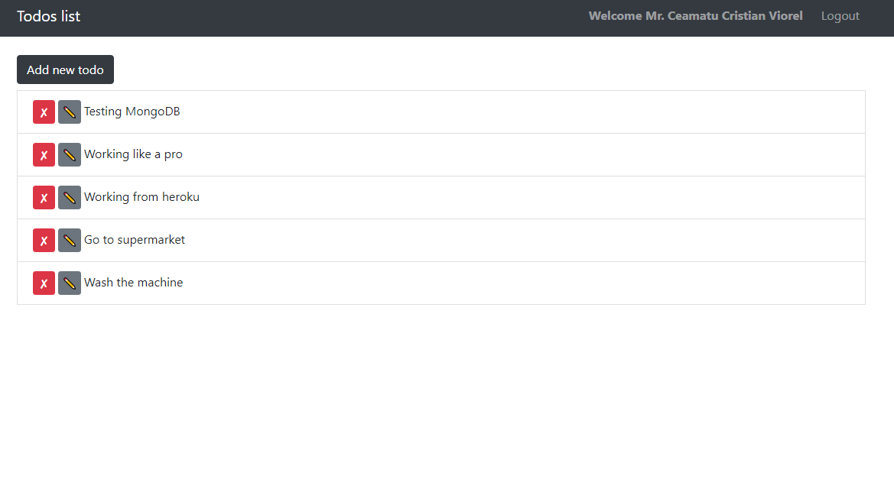

# Todo list created with the MERN (MongoDB-Express-React-Node) Stack

> The project is a Todo list created as a side project. The web app has a Login system and is connected to MongoDB.

> I built the project after watching this [youtube tutorial](https://www.youtube.com/watch?v=PBTYxXADG_k&list=PLillGF-RfqbbiTGgA77tGO426V3hRF9iE) series.
> The app is mobile responsive and you need to create an account in order to add new items.

## Built With

- MongoDB,
- Express,
- React,
- Node,
- Redux,
- Reactstrap
- Jswebtoken

## Live Demo

Heroku [Live Demo Link](https://mern-stack-todos-cristian.herokuapp.com/)

To get a local copy up and running follow these simple example steps.

### Setup

Clone the project locally and run `npm install` in both root and client directories.

## Available Scripts

In the project directory, you can run:

### `npm run dev`

Runs both the backend server and the client in development mode. 
Open [http://localhost:3000](http://localhost:3000) to view it in the browser.

The page will reload if you make edits. 
You will also see any lint errors in the console.

### `npm run server` or `npm run client`

You can run only the server or only the client with these scripts.
Open [http://localhost:3000](http://localhost:3000) for the client
Open [http://localhost:5000](http://localhost:5000) for the server

### `npm run build` from the client folder

Builds the app for production to the `build` folder. 
It correctly bundles React in production mode and optimizes the build for the best performance.

The build is minified and the filenames include the hashes. 
Your app is ready to be deployed!

See the section about [deployment](https://facebook.github.io/create-react-app/docs/deployment) for more information.

### `npm run eject` from the client folder

**Note: this is a one-way operation. Once you `eject`, you can’t go back!**

If you aren’t satisfied with the build tool and configuration choices, you can `eject` at any time. This command will remove the single build dependency from your project.

Instead, it will copy all the configuration files and the transitive dependencies (webpack, Babel, ESLint, etc) right into your project so you have full control over them. All of the commands except `eject` will still work, but they will point to the copied scripts so you can tweak them. At this point you’re on your own.

You don’t have to ever use `eject`. The curated feature set is suitable for small and middle deployments, and you shouldn’t feel obligated to use this feature. However we understand that this tool wouldn’t be useful if you couldn’t customize it when you are ready for it.

## Authors

👤 **Cristian Viorel Ceamatu**

- Github: [@githubhandle](https://github.com/cristianCeamatu)
- Twitter: [@twitterhandle](https://twitter.com/CeamatuCristian)
- Linkedin: [linkedin](https://www.linkedin.com/in/ceamatu-cristian/)

## Show your support

Give a ⭐️ if you like this project!

## 📝 License

This project is [MIT](lic.url) licensed.
